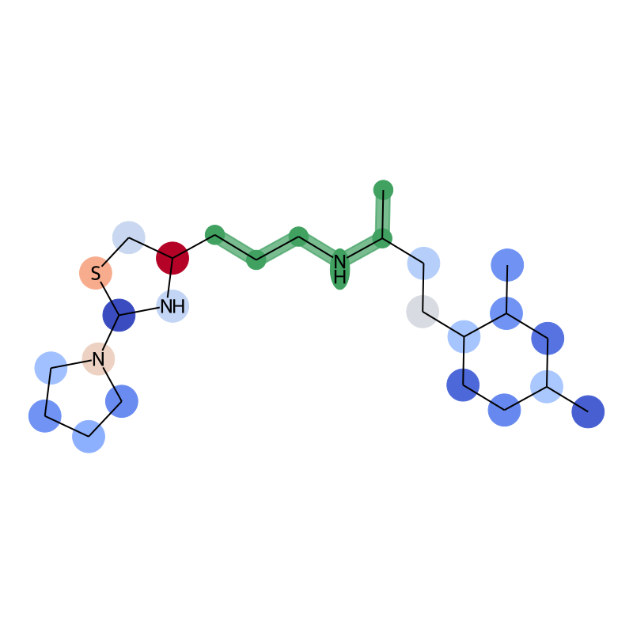

 

# DiffSHAPer

This is the official reporitory for the work **Explaining molecular diffusion models**.

We propose an explainability strategy for diffusion models showing linker desgin as a use case.

## Prerequisites

The code was developed and testes on an Ubuntu 22.04 sysyem with Python 3.10.5 and PyTorch 2.4.0 (cuda version 12.4). We believe other versions and sysyems to be compatilbe as well.

All the packages needed to run the code are available in environment.yml. We suggest to use [Anaconda](https://www.anaconda.com/download) and create an environment as

```bash
conda env create -f environment.yml
```

The enrivornment file provided within the repo was generated under and Ubuntu system. It may fail on Windows systems, so we reccomend installing the needed packages separately in this case. If you have problems installing PyTorch from the environment, install following instructions [here](https://pytorch.org/get-started/locally/)

## Generate explanations

The repository contains the script ```diffusion_explainer.py```. It will generate linkers using [DiffLinker](https://github.com/igashov/DiffLinker) and explain the generated molecules using our appreach.

The script will load parameters from ```config.yml```, where you can adjust several parameters as the number of samples to explain, the generation frames for which images should be generated, Monte Carlo sampling steps for Shapley values approximation, and others.

We also provide the notebook ```diffusion_explainer.ipynb``` for interactive sessions.

## Inspect results

Explanations are mapped to compounds structures, both in terms of graph representaitons and molecular graphs. The graph representation is generated inspired by DiffLinker, while molecular graphs are generated using the [RDKit](https://www.rdkit.org/) library. An exemplary explanation with atom importance mapped onto molecular strucutres may look like this:

<p align="center">
  
</p>

Mappings and computed Shapley values will be saved in the ```results/explanations/zinc_final_test/DATASET_NAME``` folder.

For any clarification, doubt, or curiosity, feel free to drop an [email](mailto:mastropietro@bit.uni-bonn.de)
